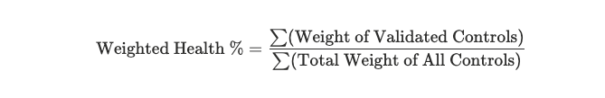

# Assessment Score (Residual Risk)

## Assessment Score

The Assessment Score quantifies vendor risk beyond a simple pass/fail. Rather than treating every control equally — where a missing phone number counts the same as missing encryption — Lema applies weighted logic to your controls so the score reflects reality: foundational security measures matter more than administrative documentation.

### How It's Calculated

The Assessment Score combines your **control weights**, each control's **validation status**, and the vendor's **inherent risk**.

**Step 1 — Weighted Health Percentage**

Lema calculates the ratio of validated control weight to total control weight across all controls in the assessment scope:

<figure><figcaption></figcaption></figure>

**Step 2 — Scoring Matrix**

The Weighted Health Percentage is mapped against the vendor's inherent risk level to produce a final qualitative score: **Acceptable**, **Concerning**, or **Unacceptable**.

| Inherent Risk | 100–76%    | 75–51%     | 50–26%     | 25–0%        |
| ------------- | ---------- | ---------- | ---------- | ------------ |
| **Critical**  | Acceptable | Concerning | Concerning | Unacceptable |
| **High**      | Acceptable | Acceptable | Concerning | Concerning   |
| **Medium**    | Acceptable | Acceptable | Acceptable | Concerning   |
| **Low**       | Acceptable | Acceptable | Acceptable | Acceptable   |


**Critical Override Rule**

If any control with Weight 5 is in a Gap state, the Assessment Score cannot be Acceptable — regardless of the overall percentage. A single foundational failure cannot be masked by a high volume of minor successes.


### Customizing Weights

Go to **Settings → Controls** and use the **Weight** field to adjust the value (1–5) for any control.

Weight changes apply to open and ongoing assessments. Completed assessments are not affected.


**Best practices for customization**

* **Maintain the hierarchy.** If everything is Weight 5, nothing is critical. Reserve it for controls that would cause you to immediately fail a vendor.
* **Separate policy from implementation.** A Password Policy document (Tier 2) is less effective than MFA enforcement (Tier 4). The document says users _should_ use strong passwords; the tool _ensures_ access is secured. Weight them accordingly.
* **Align with your business logic.** If availability is critical to your organization — for example, you're onboarding a hosting provider — consider increasing Business Continuity controls from Tier 3 to Tier 4 or 5.

